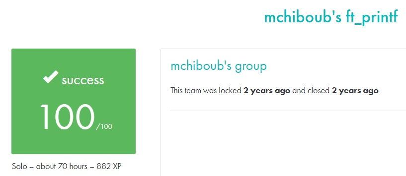

# FT_PRINTF #

## What the project does: ##
This project, ft_printf, involves recreating the C standard library function printf(). It implements a version of printf() that handles various data type conversions (characters, strings, integers, hexadecimals, etc.), mimicking the behavior of the original function.

## Why the project is useful: ##
The project is useful because it teaches how to handle variadic functions in C, a key skill for writing flexible and efficient code. Additionally, having a custom implementation of printf() allows you to integrate it into future projects, offering control over formatting and output functions.

[Subject of this project](en.subject.pdf)